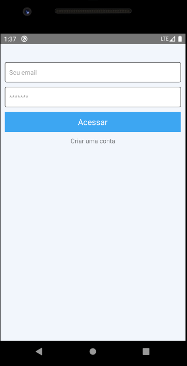
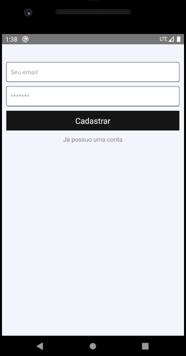
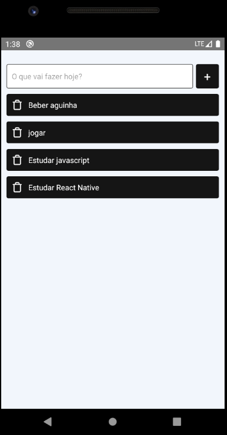

<h1 align="center"> Aplicativo de tarefas </h1>

Este projeto consiste em um aplicativo que permite a criação e gerenciamento de tarefas. O usuário pode adicionar, editar e excluir tarefas, bem como marcá-las como concluídas ou não concluídas.

  
  
  

## 🚀 Tecnologias utilizadas

Este projeto foi desenvolvido utilizando as seguintes tecnologias:

- HTML
- CSS
- JavaScript
- React Native
- firebase

## 💻 Funcionalidades do aplicativo

O aplicativo permite as seguintes funcionalidades:

- Adicionar uma nova tarefa;
- Editar uma tarefa existente;
- Excluir uma tarefa;
